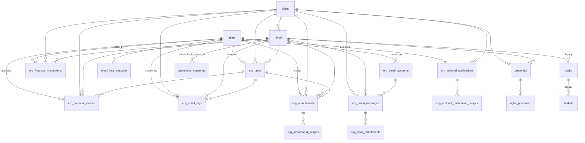

# Database — Schema

SQLite (`app.db`). 17 tabelle attive. Migrazioni: `migrations/versions/0001-0003`.

## Enumerazioni (tuple Python in `app/models.py`)

### Ruoli e stati generali

| Variabile | Valori |
|-----------|--------|
| `VALID_USER_ROLES` | `admin`, `operatore`, `readonly` |
| `CALENDAR_EVENT_TYPES` | `appuntamento`, `scadenza`, `impegno_cliente`, `promemoria`, `generale` |
| `EMAIL_DIRECTIONS` | `inbound`, `outbound` |
| `MAIL_DIRECTIONS` | `inbound`, `outbound` |

### Task

| Variabile | Valori |
|-----------|--------|
| `TASK_CATEGORIES` | `social_media`, `grafica`, `amministrazione`, `fotografia`, `web`, `commerciale`, `generale` |
| `TASK_STATUSES` | `da_fare`, `in_corso`, `in_revisione`, `completata`, `annullata` |
| `TASK_PRIORITIES` | `bassa`, `media`, `alta`, `urgente` |

### Editoriale

| Variabile | Valori |
|-----------|--------|
| `EDITORIAL_PLATFORMS` | `instagram`, `facebook` |
| `EDITORIAL_CONTENT_TYPES` | `post_grafico`, `post_fotografico`, `storia`, `carousel`, `reel`, `video` |
| `EDITORIAL_STATUSES` | `idea`, `da_produrre`, `in_revisione`, `approvato`, `programmato`, `pubblicato`, `annullato` |
| `EDITORIAL_CLIENT_APPROVAL_STATUSES` | `da_approvare`, `approvato`, `modifiche_richieste` |

### Finanza

| Variabile | Valori |
|-----------|--------|
| `FINANCE_MOVEMENT_TYPES` | `entrata`, `uscita` |
| `FINANCE_MOVEMENT_STATUSES` | `prevista`, `effettiva` |
| `FINANCE_EXPENSE_TYPES` | `fissa`, `variabile` |
| `FINANCE_CATEGORIES` | `pagamento_cliente`, `fornitore`, `software`, `advertising`, `consulenza`, `attrezzatura`, `tasse`, `stipendio`, `commercialista`, `banca`, `costituzione_societa`, `generale` |

## Tabelle

### `users`

| Colonna | Tipo | Note |
|---------|------|------|
| `id` | INTEGER PK | |
| `name` | VARCHAR(100) | nullable |
| `email` | VARCHAR(255) | UNIQUE, NOT NULL, indexed |
| `password_hash` | VARCHAR(255) | NOT NULL |
| `role` | VARCHAR(20) | default `readonly` |
| `is_active` | BOOLEAN | default `True` |
| `created_at` | DATETIME | default `utcnow` |

### `clienti`

| Colonna | Tipo | Note |
|---------|------|------|
| `id` | INTEGER PK | |
| `name` | VARCHAR(100) | NOT NULL |
| `ragsoc` | VARCHAR(100) | NOT NULL |
| `indirizzo` | VARCHAR(100) | nullable |
| `citta` | VARCHAR(50) | nullable |
| `cap` | VARCHAR(5) | nullable |
| `provincia` | VARCHAR(2) | nullable |
| `email` | VARCHAR(100) | NOT NULL |
| `telefono` | VARCHAR(20) | NOT NULL |
| `p_iva` | VARCHAR(30) | nullable |
| `sdi` | VARCHAR(7) | nullable |
| `pec` | VARCHAR(100) | nullable |
| `colore` | VARCHAR(20) | nullable |
| `note` | TEXT | nullable |
| `folder_path` | VARCHAR(255) | UNIQUE, nullable |

### `lavori`

| Colonna | Tipo | Note |
|---------|------|------|
| `id` | INTEGER PK | |
| `descrizione` | VARCHAR(200) | NOT NULL |
| `data_inizio` | DATE | nullable |
| `data_fine` | DATE | nullable |
| `data_pagamento` | DATE | nullable |
| `stato` | VARCHAR(50) | nullable |
| `priorita` | VARCHAR(50) | nullable |
| `note` | TEXT | nullable |
| `preventivato` | FLOAT | default `0` |
| `preventivo_pdf_path` | VARCHAR(255) | nullable |
| `folder_path` | VARCHAR(255) | UNIQUE, nullable |
| `cliente_id` | INTEGER FK → `clienti.id` | NOT NULL |

### `tasks` (TaskLavoro — task legacy)

| Colonna | Tipo | Note |
|---------|------|------|
| `id` | INTEGER PK | |
| `name` | VARCHAR(100) | NOT NULL |
| `tipo` | VARCHAR(20) | NOT NULL |
| `timestamp` | DATETIME | default `now` |
| `lavoro_id` | INTEGER FK → `lavori.id` | NOT NULL |
| `note` | TEXT | NOT NULL |
| `files` | relationship → `taskfile` | cascade delete |

### `taskfile`

| Colonna | Tipo | Note |
|---------|------|------|
| `id` | INTEGER PK | |
| `filename` | VARCHAR(100) | NOT NULL |
| `tipo` | VARCHAR(20) | NOT NULL |
| `size` | FLOAT | NOT NULL |
| `task_id` | INTEGER FK → `tasks.id` | NOT NULL |
| `note` | TEXT | NOT NULL |

### `erp_tasks` (Task — task moderni)

| Colonna | Tipo | Note |
|---------|------|------|
| `id` | INTEGER PK | |
| `name` | VARCHAR(160) | NOT NULL |
| `note` | TEXT | nullable |
| `category` | VARCHAR(40) | default `generale` |
| `status` | VARCHAR(40) | default `da_fare` |
| `priority` | VARCHAR(40) | default `media` |
| `due_date` | DATE | nullable |
| `lavoro_id` | INTEGER FK → `lavori.id` | nullable |
| `cliente_id` | INTEGER FK → `clienti.id` | nullable |
| `assignee_id` | INTEGER FK → `users.id` | nullable |
| `created_at` | DATETIME | default `utcnow` |
| `updated_at` | DATETIME | auto-update |

### `erp_calendar_events`

| Colonna | Tipo | Note |
|---------|------|------|
| `id` | INTEGER PK | |
| `title` | VARCHAR(160) | NOT NULL |
| `description` | TEXT | nullable |
| `event_type` | VARCHAR(40) | default `generale` |
| `start_datetime` | DATETIME | NOT NULL |
| `end_datetime` | DATETIME | nullable |
| `cliente_id` | INTEGER FK → `clienti.id` | nullable |
| `lavoro_id` | INTEGER FK → `lavori.id` | nullable |
| `task_id` | INTEGER FK → `erp_tasks.id` | nullable |
| `assigned_user_id` | INTEGER FK → `users.id` | nullable |
| `created_at` | DATETIME | default `utcnow` |
| `updated_at` | DATETIME | auto-update |

### `erp_editorial_publications`

| Colonna | Tipo | Note |
|---------|------|------|
| `id` | INTEGER PK | |
| `cliente_id` | INTEGER FK → `clienti.id` | NOT NULL, indexed |
| `publication_date` | DATE | NOT NULL, indexed |
| `platform` | VARCHAR(40) | default `instagram`, indexed |
| `platforms` | VARCHAR(200) | nullable (multi-piattaforma) |
| `content_type` | VARCHAR(40) | default `post_grafico` |
| `title` | VARCHAR(180) | NOT NULL |
| `caption` | TEXT | nullable |
| `preview_image_path` | VARCHAR(500) | nullable |
| `status` | VARCHAR(40) | default `idea`, indexed |
| `assigned_user_id` | INTEGER FK → `users.id` | nullable, indexed |
| `client_approval_status` | VARCHAR(40) | default `da_approvare` |
| `internal_notes` | TEXT | nullable |
| `asset_url` | VARCHAR(1000) | nullable |
| `created_at` | DATETIME | default `utcnow` |
| `updated_at` | DATETIME | auto-update |
| `images` | relationship → `erp_editorial_publication_images` | cascade delete |

### `erp_editorial_publication_images`

| Colonna | Tipo | Note |
|---------|------|------|
| `id` | INTEGER PK | |
| `publication_id` | INTEGER FK → `erp_editorial_publications.id` | NOT NULL, indexed |
| `image_path` | VARCHAR(500) | NOT NULL |
| `sort_order` | INTEGER | default `0` |
| `created_at` | DATETIME | default `utcnow` |

### `erp_financial_movements`

| Colonna | Tipo | Note |
|---------|------|------|
| `id` | INTEGER PK | |
| `title` | VARCHAR(160) | NOT NULL |
| `description` | TEXT | nullable |
| `movement_type` | VARCHAR(20) | NOT NULL |
| `movement_status` | VARCHAR(20) | default `prevista` |
| `expense_type` | VARCHAR(20) | nullable |
| `category` | VARCHAR(50) | default `generale` |
| `amount` | NUMERIC(12,2) | NOT NULL |
| `movement_date` | DATE | NOT NULL |
| `month` | INTEGER | NOT NULL |
| `year` | INTEGER | NOT NULL |
| `cliente_id` | INTEGER FK → `clienti.id` | nullable |
| `lavoro_id` | INTEGER FK → `lavori.id` | nullable |
| `created_by` | INTEGER FK → `users.id` | nullable |
| `created_at` | DATETIME | default `utcnow` |
| `updated_at` | DATETIME | auto-update |

### `erp_email_logs`

| Colonna | Tipo | Note |
|---------|------|------|
| `id` | INTEGER PK | |
| `subject` | VARCHAR(255) | NOT NULL |
| `body` | TEXT | nullable |
| `direction` | VARCHAR(20) | default `outbound` |
| `email_address` | VARCHAR(255) | NOT NULL, indexed |
| `cliente_id` | INTEGER FK → `clienti.id` | nullable |
| `lavoro_id` | INTEGER FK → `lavori.id` | nullable |
| `task_id` | INTEGER FK → `erp_tasks.id` | nullable |
| `sent_at` | DATETIME | NOT NULL, default `utcnow` |
| `created_by` | INTEGER FK → `users.id` | nullable |
| `message_id` | VARCHAR(255) | nullable, indexed |
| `thread_id` | VARCHAR(255) | nullable, indexed |
| `provider` | VARCHAR(80) | nullable |
| `provider_account` | VARCHAR(255) | nullable |
| `created_at` | DATETIME | default `utcnow` |
| `updated_at` | DATETIME | auto-update |

### `erp_email_accounts`

| Colonna | Tipo | Note |
|---------|------|------|
| `id` | INTEGER PK | |
| `label` | VARCHAR(120) | NOT NULL |
| `email_address` | VARCHAR(255) | NOT NULL, indexed |
| `imap_host` | VARCHAR(255) | NOT NULL |
| `imap_port` | INTEGER | default `993` |
| `imap_use_ssl` | BOOLEAN | default `True` |
| `smtp_host` | VARCHAR(255) | NOT NULL |
| `smtp_port` | INTEGER | default `587` |
| `smtp_use_tls` | BOOLEAN | default `True` |
| `username` | VARCHAR(255) | NOT NULL |
| `password_encrypted` | TEXT | nullable (Fernet) |
| `is_active` | BOOLEAN | default `True` |
| `last_sync_at` | DATETIME | nullable |
| `created_by` | INTEGER FK → `users.id` | nullable |
| `created_at` | DATETIME | default `utcnow` |
| `updated_at` | DATETIME | auto-update |

### `erp_email_messages`

| Colonna | Tipo | Note |
|---------|------|------|
| `id` | INTEGER PK | |
| `account_id` | INTEGER FK → `erp_email_accounts.id` | NOT NULL |
| `message_id` | VARCHAR(512) | nullable, indexed |
| `imap_uid` | VARCHAR(120) | nullable |
| `folder` | VARCHAR(120) | default `INBOX` |
| `subject` | VARCHAR(500) | nullable |
| `from_address` | VARCHAR(500) | nullable |
| `to_addresses` | TEXT | nullable |
| `cc_addresses` | TEXT | nullable |
| `reply_to` | VARCHAR(500) | nullable |
| `body_text` | TEXT | nullable |
| `body_html` | TEXT | nullable |
| `direction` | VARCHAR(20) | default `inbound` |
| `is_read` | BOOLEAN | default `False` |
| `sent_at` | DATETIME | nullable |
| `received_at` | DATETIME | nullable |
| `cliente_id` | INTEGER FK → `clienti.id` | nullable |
| `lavoro_id` | INTEGER FK → `lavori.id` | nullable |
| `created_at` | DATETIME | default `utcnow` |
| `updated_at` | DATETIME | auto-update |
| Unique | `(account_id, folder, imap_uid)` | |

### `erp_email_attachments`

| Colonna | Tipo | Note |
|---------|------|------|
| `id` | INTEGER PK | |
| `message_id` | INTEGER FK → `erp_email_messages.id` | NOT NULL |
| `filename` | VARCHAR(500) | nullable |
| `content_type` | VARCHAR(255) | nullable |
| `size` | INTEGER | nullable |
| `storage_path` | VARCHAR(1000) | nullable |
| `created_at` | DATETIME | default `utcnow` |

### `preventivi`

| Colonna | Tipo | Note |
|---------|------|------|
| `id` | INTEGER PK | |
| `descrizione` | VARCHAR(200) | NOT NULL |
| `cliente_id` | INTEGER FK → `clienti.id` | NOT NULL |
| `data_creazione` | DATETIME | default `utcnow` |
| `stato` | VARCHAR(20) | default `bozza` |
| `totale_preventivo` | FLOAT | nullable |
| `lavoro_id` | INTEGER FK → `lavori.id` | nullable |
| `data_invio` | DATE | nullable |
| `data_followup` | DATE | nullable |
| `convertito_in_lavoro_id` | INTEGER FK → `lavori.id` | nullable |

### `righe_preventivo`

| Colonna | Tipo | Note |
|---------|------|------|
| `id` | INTEGER PK | |
| `qty` | NUMERIC(10,2) | default `1` |
| `descrizione` | TEXT | NOT NULL |
| `prezzo_ie` | NUMERIC(10,2) | NOT NULL (imponibile) |
| `prezzo_ii` | NUMERIC(10,2) | NOT NULL (inclusa IVA 22%) |
| `totale_riga` | NUMERIC(10,2) | NOT NULL |
| `preventivo_id` | INTEGER FK → `preventivi.id` | NOT NULL |

### `erp_moodboards`

| Colonna | Tipo | Note |
|---------|------|------|
| `id` | INTEGER PK | |
| `title` | VARCHAR(160) | NOT NULL |
| `description` | TEXT | nullable |
| `task_id` | INTEGER FK → `erp_tasks.id` | nullable, indexed |
| `cliente_id` | INTEGER FK → `clienti.id` | nullable, indexed |
| `lavoro_id` | INTEGER FK → `lavori.id` | nullable, indexed |
| `created_by` | INTEGER FK → `users.id` | nullable |
| `created_at` | DATETIME | default `utcnow` |
| `updated_at` | DATETIME | auto-update |
| `images` | relationship → `erp_moodboard_images` | cascade delete |

### `erp_moodboard_images`

| Colonna | Tipo | Note |
|---------|------|------|
| `id` | INTEGER PK | |
| `moodboard_id` | INTEGER FK → `erp_moodboards.id` | NOT NULL, indexed |
| `title` | VARCHAR(160) | nullable |
| `image_path` | VARCHAR(500) | nullable (upload) |
| `image_url` | VARCHAR(2000) | nullable (URL) |
| `source_type` | VARCHAR(10) | default `upload` |
| `source_url` | VARCHAR(2000) | nullable |
| `note` | TEXT | nullable |
| `sort_order` | INTEGER | default `0` |
| `created_at` | DATETIME | default `utcnow` |

## Diagramma ER

